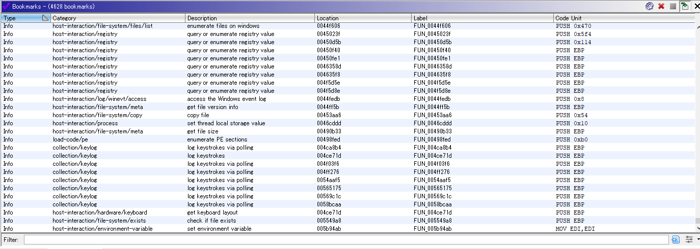

# capa2ghidra

capaのjsonフォーマットの出力結果をghidraのブックマークとEOLコメントに追加するpythonスクリプトです。
自分の環境では[Ghidrathon](https://github.com/mandiant/Ghidrathon)を利用しているのでpython3で動作することを確認していますが、jythonでも動作すると思います。

とりあえずで作ったので全部の出力結果に対して正常に動作するかは不明です。

